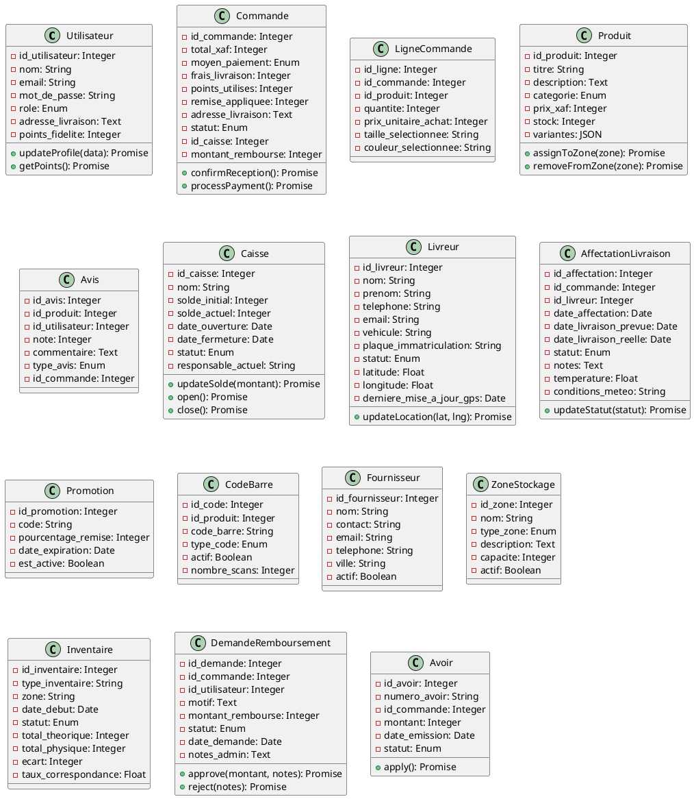
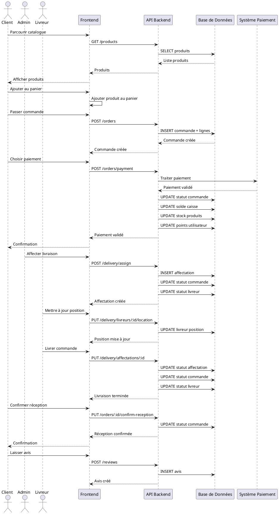

# Modélisation UML et MCD - Sport-Equip

## Modèle Conceptuel de Données (MCD)

### Entités et Relations

```
┌─────────────────┐
│   UTILISATEUR   │
├─────────────────┤
│ PK id_utilisateur│
│    nom          │
│    email        │
│    mot_de_passe │
│    role         │
│    adresse_livraison│
│    points_fidelite│
└────────┬────────┘
         │
         │ 1,n
         │
    ┌────▼────┐
    │ COMMANDE │
    ├──────────┤
    │ PK id_commande│
    │    total_xaf    │
    │    moyen_paiement│
    │    frais_livraison│
    │    points_utilisés│
    │    remise_appliquée│
    │    adresse_livraison│
    │    statut        │
    │    id_caisse     │
    │    montant_rembourse│
    └────┬────┬────┬───┘
         │    │    │
         │    │    │ 1,n
         │    │    │
         │    │    │
    ┌────▼────┐ │ ┌─▼─────────┐
    │LIGNE    │ │ │  CAISSE   │
    │COMMANDE │ │ ├───────────┤
    ├─────────┤ │ │ PK id_caisse│
    │ PK id_   │ │ │    nom     │
    │  ligne   │ │ │    solde_initial│
    │ FK id_   │ │ │    solde_actuel│
    │  commande│ │ │    statut  │
    │ FK id_   │ │ │    responsable_actuel│
    │  produit │ │ └───────────┘
    │    quantite│ │
    │    prix_  │ │
    │    unitaire_achat│
    │    taille_selectionnee│
    │    couleur_selectionnee│
    └────┬────┘ │
         │      │
         │ 1,n  │
         │      │
    ┌────▼──────┐
    │  PRODUIT  │
    ├───────────┤
    │ PK id_produit│
    │    titre   │
    │    description│
    │    categorie│
    │    prix_xaf│
    │    stock   │
    │    variantes│
    └────┬───────┘
         │
         │ 1,n
         │
    ┌────▼──────┐
    │    AVIS    │
    ├───────────┤
    │ PK id_avis│
    │ FK id_produit│
    │ FK id_utilisateur│
    │    note    │
    │    commentaire│
    │    type_avis│
    │    id_commande│
    └───────────┘

┌─────────────────┐
│   LIVREUR       │
├─────────────────┤
│ PK id_livreur   │
│    nom          │
│    prenom       │
│    telephone    │
│    email        │
│    vehicule     │
│    plaque_immatriculation│
│    statut       │
│    latitude     │
│    longitude    │
│    derniere_mise_a_jour_gps│
└────────┬────────┘
         │
         │ 1,n
         │
    ┌────▼──────────────┐
    │ AFFECTATION       │
    │ LIVRAISON         │
    ├───────────────────┤
    │ PK id_affectation │
    │ FK id_commande    │
    │ FK id_livreur     │
    │    date_affectation│
    │    date_livraison_prevue│
    │    date_livraison_reelle│
    │    statut         │
    │    notes          │
    │    temperature    │
    │    conditions_meteo│
    └───────────────────┘

┌─────────────────┐
│   PROMOTION     │
├─────────────────┤
│ PK id_promotion │
│    code         │
│    pourcentage_remise│
│    date_expiration│
│    est_active    │
└─────────────────┘

┌─────────────────┐
│   CODE_BARRE    │
├─────────────────┤
│ PK id_code      │
│ FK id_produit   │
│    code_barre   │
│    type_code    │
│    actif        │
│    nombre_scans │
└─────────────────┘

┌─────────────────┐
│   FOURNISSEUR    │
├─────────────────┤
│ PK id_fournisseur│
│    nom          │
│    contact      │
│    email        │
│    telephone    │
│    ville        │
│    actif        │
└─────────────────┘

┌─────────────────┐
│   ZONE_STOCKAGE │
├─────────────────┤
│ PK id_zone      │
│    nom          │
│    type_zone    │
│    description  │
│    capacite     │
│    actif        │
└────────┬────────┘
         │
         │ n,m
         │
    ┌────▼──────┐
    │  PRODUIT  │
    └───────────┘

┌─────────────────┐
│   INVENTAIRE    │
├─────────────────┤
│ PK id_inventaire│
│    type_inventaire│
│    zone         │
│    date_debut   │
│    statut       │
│    total_theorique│
│    total_physique│
│    ecart        │
│    taux_correspondance│
└─────────────────┘

┌─────────────────┐
│   DEMANDE_REMBOURSEMENT│
├─────────────────┤
│ PK id_demande   │
│ FK id_commande  │
│ FK id_utilisateur│
│    motif        │
│    montant_rembourse│
│    statut       │
│    date_demande │
│    notes_admin  │
└─────────────────┘

┌─────────────────┐
│   AVOIR         │
├─────────────────┤
│ PK id_avoir     │
│    numero_avoir │
│ FK id_commande  │
│    montant      │
│    date_emission│
│    statut       │
└─────────────────┘
```

## Diagramme de Classes UML

### Classes Principales



## Diagramme de Cas d'Utilisation UML

```plantuml
@startuml
left to right direction
actor Client
actor Admin
actor Livreur

rectangle "Sport-Equip" {
  usecase "S'inscrire/Se connecter"
  usecase "Parcourir le catalogue"
  usecase "Ajouter au panier"
  usecase "Passer commande"
  usecase "Choisir moyen de paiement"
  usecase "Confirmer réception"
  usecase "Laisser avis produit"
  usecase "Laisser avis livraison"
  usecase "Télécharger bordereau livraison"
  usecase "Télécharger ticket caisse"
  usecase "Voir profil et commandes"
  usecase "Gérer produits"
  usecase "Gérer clients"
  usecase "Gérer commandes"
  usecase "Gérer livreurs"
  usecase "Affecter livraison"
  usecase "Gérer caisses"
  usecase "Gérer promotions"
  usecase "Gérer zones stockage"
  usecase "Gérer inventaires"
  usecase "Voir avis livraison"
  usecase "Gérer fournisseurs"
  usecase "Gérer codes-barres"
  usecase "Gérer remboursements"
  usecase "Gérer avoirs"
  usecase "Voir statistiques"
  usecase "Accepter livraison"
  usecase "Mettre à jour position GPS"
  usecase "Voir météo"
}

Client --> "S'inscrire/Se connecter"
Client --> "Parcourir le catalogue"
Client --> "Ajouter au panier"
Client --> "Passer commande"
Client --> "Choisir moyen de paiement"
Client --> "Confirmer réception"
Client --> "Laisser avis produit"
Client --> "Laisser avis livraison"
Client --> "Télécharger bordereau livraison"
Client --> "Télécharger ticket caisse"
Client --> "Voir profil et commandes"

Admin --> "Gérer produits"
Admin --> "Gérer clients"
Admin --> "Gérer commandes"
Admin --> "Gérer livreurs"
Admin --> "Affecter livraison"
Admin --> "Gérer caisses"
Admin --> "Gérer promotions"
Admin --> "Gérer zones stockage"
Admin --> "Gérer inventaires"
Admin --> "Voir avis livraison"
Admin --> "Gérer fournisseurs"
Admin --> "Gérer codes-barres"
Admin --> "Gérer remboursements"
Admin --> "Gérer avoirs"
Admin --> "Voir statistiques"

Livreur --> "Accepter livraison"
Livreur --> "Mettre à jour position GPS"
Livreur --> "Voir météo"
@enduml
```



## Diagramme de Séquence UML - Processus de Commande



## Règles de Gestion

### R1 - Points de Fidélité
- 100 FCFA = 1 point
- Les points gagnés ne génèrent pas de nouveaux points
- Les points peuvent être utilisés pour payer

### R2 - Gestion des Caisses
- Chaque commande payée est liée à une caisse ouverte
- Le solde de la caisse est mis à jour automatiquement
- Si le client donne trop, un remboursement est calculé
- L'admin est notifié des remboursements

### R3 - Livraison
- Une commande ne peut être livrée que si elle est payée
- Un livreur ne peut être affecté que s'il est disponible
- Le statut du livreur est synchronisé automatiquement

### R4 - Avis
- Les avis peuvent être de type "produit" ou "livraison"
- Les avis produits s'affichent dans le catalogue
- Les avis livraison sont consultables par l'admin
- Un utilisateur doit avoir reçu sa commande pour laisser un avis

### R5 - Stock
- Le stock est déduit uniquement après validation du paiement
- Les produits peuvent être rangés dans plusieurs zones
- Les alertes de stock bas sont automatiques

### R6 - Codes-barres
- Chaque produit a un code-barres EAN13 généré automatiquement
- Les codes-barres peuvent être désactivés/activés
- Le nombre de scans est comptabilisé
